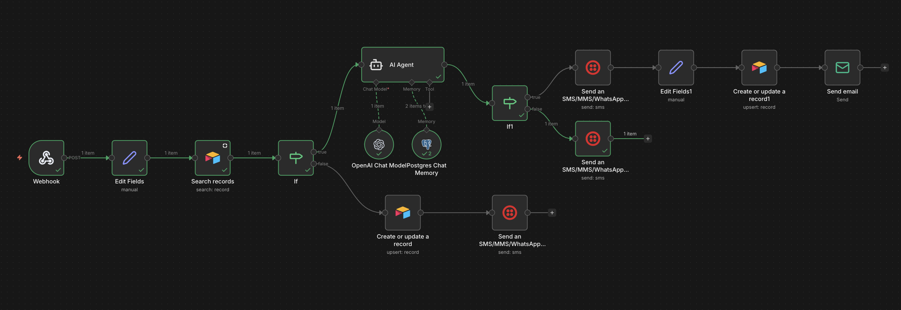
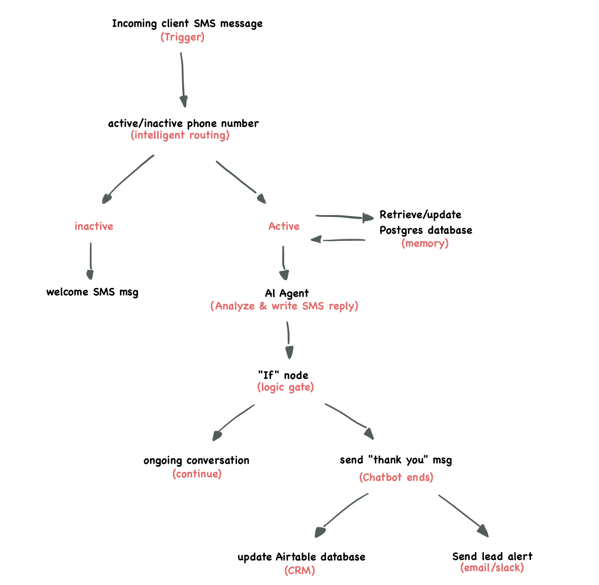

# 🤖 AI-Powered Lead Qualification Engine (n8n + PostgreSQL + OpenAI)

A production-grade automation system that handles 24/7 lead intake via SMS, qualifies prospects using an LLM-driven verification loop, and maintains stateful conversation history in a PostgreSQL database.

## 🎯 The Problem
Home service businesses (Plumbers, HVAC, etc.) lose potential revenue due to:
* **Response Latency:** Leads go cold if not answered within 5 minutes.
* **Incomplete Data:** Back-and-forth texting to get addresses or job details is time-consuming.
* **Data Silos:** Leads trapped in SMS threads instead of a centralized CRM.

## ✨ The Solution
This engine acts as a 24/7 virtual office assistant. It doesn't just "chat"; it follows a logical business process to qualify a lead and push "Ready-to-Quote" data directly to the business owner.

## 🏗️ Workflow Overview
Here is a detailed visual walkthrough of the architecture in n8n.

  
   
  <i>The complete end-to-end automation architecture.</i>

## 🧠 System Logic
The system is built on a non-linear branching architecture to handle both customer-facing communication and internal data processing simultaneously.

  
   

## 🧩 How it Works (Technical Deep Dive)
1. **Intake:** Twilio sends a webhook payload to n8n containing the message body and sender ID.
2. **Persistence:** The system queries Postgres to retrieve the last 10 messages of context.
3. **Reasoning:** OpenAI evaluates the input against 4 mandatory fields: **Service Type, Address, Urgency, and Specific Details.**
4. **Verification:** The AI provides a summary to the user and asks for a "Confirmation."
5. **Closure:** Upon confirmation, the system triggers a final CRM update and an instant Lead Alert email with a "Click-to-Call" button.

## 🛠️ Technical Stack
* **Orchestration:** n8n (Self-hosted/Cloud)
* **LLM:** OpenAI GPT-4o
* **Database (Memory):** PostgreSQL (Supabase) 
* **Communication:** Twilio API (SMS)
* **CRM:** Airtable
* **Security:** Configured SSL/TLS for secure DB transactions.

## 🚀 Key Technical Features
* **Atomic Logging:** Every message (Human and AI) is logged to Postgres with a unique Session ID.
* **Custom Prompt Engineering:** System prompts include strict constraints on SMS character limits and professional tone.
* **Error Handling:** Implemented "Always Output Data" settings to ensure the workflow doesn't break on new leads with zero history.
---
*Developed by Usama Elsaigh - Specialist in AI Automation & Systems Architecture.*
